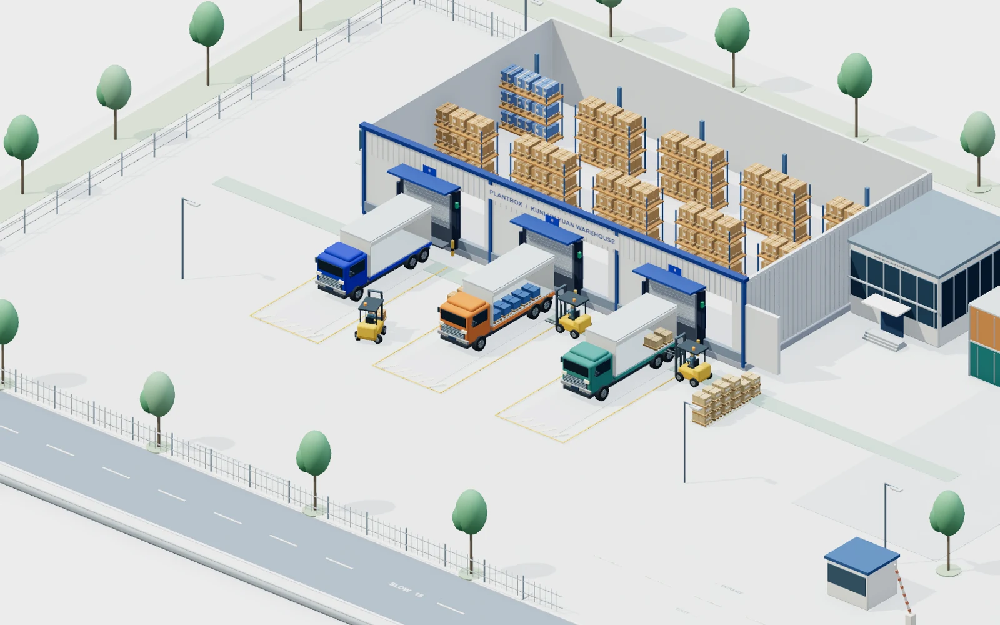

# Plantbox · Warehouse operations, made visible

[简体中文](README.md) · **English**

A working logistics site in your browser. Built with React, TypeScript, React Three Fiber and Three.js, Plantbox connects a 3D environment, physical cargo handling and operation data.



## Website and demo

The homepage introduces the project. The project menu opens the full warehouse demo, documentation and GitHub. Chinese is the default language. Both languages have direct, refreshable and shareable URLs. Switching languages keeps the current page; inside the demo, it also preserves the clock, camera, inventory and operation progress.

| Page                 | English                      | 简体中文                          |
| -------------------- | ---------------------------- | --------------------------------- |
| Project homepage     | `/#/en`                      | `/#/zh` (`/` defaults to Chinese) |
| Full warehouse demo  | `/#/en/demo`                 | `/#/zh/demo`                      |
| GitHub documentation | [README.en.md](README.en.md) | [README.md](README.md)            |

English pages link to the English demo and documentation; Chinese pages link to their Chinese counterparts. The demo's project menu returns to the homepage in the same language. The homepage uses a WebP capture of the actual scene. Three.js, physics and the simulation clock load only when you enter the demo.

## Run locally

Requires Node.js 22.18+; Node.js 24 is recommended.

```sh
npm install
npm run dev
```

Open the [English homepage](http://localhost:5173/#/en) or the [English demo](http://localhost:5173/#/en/demo). The development server uses the fixed port 5173. For Chinese instructions and entry points, see the [Chinese README](README.md).

```sh
npm test         # Inventory, vehicle kinematics, collision and 30-minute physical handling checks
npm run build   # TypeScript checks and production build
npm run preview # Preview the production build in dist
```

## Features

- A complete Kunlun Yuan Warehouse site: pitched-roof warehouse, interior racks, three docks, glass-fronted office, container yard, barriers, roads, fences and landscaping.
- Procedural 3D models with static geometry merged by material. Fonts ship locally; no model or font CDN is required at runtime.
- Three trucks cycle through arrival, docking, handling, departure and transit. Three rear-steered forklifts insert forks, lift, carry loads low and set them down.
- Independent pallet rigid bodies with stable IDs. Yard cargo exists before pickup. Cargo unloaded from the orange truck stays in the receiving area; cargo loaded onto the other trucks stays in assigned positions and leaves with them.
- Trucks obey axle-based motion constraints: stops before gear changes, continuous steering arcs while reversing, a slow straight approach to the dock, departure yielding and a turning exit. Front wheels use Ackermann steering; all six wheels roll according to their own travel distance.
- Object selection, detail panels, camera presets, zoom, rotation, openable roof, labels, site map and full screen.
- Inventory tables, reserved and available quantities, stock alerts, simulated restocking, shipment tracking and activity logs.
- Global search, pause/resume, 1×/5×/10× speed and simulation reset.
- Detailed desktop lighting with ambient occlusion, shadows and tone mapping. Mobile defaults to balanced rendering; both modes are available in settings.
- Responsive layouts, mobile detail panels, keyboard focus management and dialog shortcuts.

## Controls

- Left-drag to orbit, right-drag to pan, and scroll to zoom. Touch screens support one-finger orbit and pinch-to-zoom.
- Select a model, scene label, dock or equipment row to inspect it.
- `Space` pauses/resumes; `⌘K` / `Ctrl+K` opens search; `Esc` closes dialogs.
- **Open roof** reveals the interior. Camera presets focus on docks, the yard, the interior or a top-down view.
- Switch languages at the top right of the website or demo. The project menu links to the homepage and README in the current language.

## Startup performance

The base site, physics engine and detailed lighting load separately. The first frame includes trucks, forklifts and all initial pallets. Rapier takes over those objects using the same pure-data snapshot. The simulation clock stays still until physics is ready, and a user's pause choice is preserved. Detailed lighting loads afterward with the original high-quality settings.

Pallets of the same type and forklift bodies share immutable geometry. Each pallet still has its own object, ID and rigid body. Fonts are losslessly converted from TTF to WOFF2, preserving glyphs, weights and licenses. Three.js and Rapier have separate content-hashed bundles; changing only interface text was verified not to change those library filenames.

The following historical comparison was recorded on 2026-10-05, **before the website redesign**, between the startup-optimized build and commit `a1d5b03`. It measures the full warehouse demo, not the introduction homepage. Environment: Apple M4 Pro, headless Chrome, 1440 × 900, browser cache disabled; medians of three runs per condition. Both builds used gzip via Vite's production preview. The throttled profile was 6 Mbps download with 80 ms latency.

| Metric                                                          |   Before |    After | Change                                                 |
| --------------------------------------------------------------- | -------: | -------: | ------------------------------------------------------ |
| First 3D draw with all initial pallets, throttled               |  2.930 s |  1.186 s | 59.5% faster                                           |
| Same metric on a direct local connection                        |  0.481 s |  0.506 s | 25 ms slower; the main benefit is less network waiting |
| Base 3D script transfer                                         | 1,134 KB |   259 KB | About 77% less                                         |
| Complete startup transfer, including later physics and lighting | 1.712 MB | 1.399 MB | 18.3% less                                             |
| Initial font transfer                                           |   479 KB |   167 KB | 65.1% less                                             |

Under throttling, detailed lighting was ready at about 1.65 seconds and physics at about 2.49 seconds. The site and camera could be explored beforehand. Both versions used the same probe: the first WebGL draw after all 42 pallet labels had been created. This is not browser LCP and does not predict all devices or real-world networks. Splitting improves visibility timing and cache reuse; font compression accounts for most of the total transfer reduction. Raw per-run summaries are in [`benchmarks/loading.json`](benchmarks/loading.json).

To repeat the benchmark, provide Playwright and Chromium. `PLAYWRIGHT_MODULE` can point to an installed Playwright module, and `CHROME_PATH` to a Chrome executable. Run `npm run build` and `npm run preview`, then:

```sh
node scripts/measure-loading.cjs 'http://localhost:4173/#/en/demo' /tmp/plantbox-loading.json
```

Regenerate fonts with `scripts/convert-fonts.py` using Python with `fonttools` and `brotli` installed. Original TTF files remain for reproducibility; the site requests only WOFF2.

Deploy `dist`. Configure `Cache-Control: public, max-age=31536000, immutable` for hashed `/assets/*`, revalidation for HTML, and gzip or Brotli compression. Configure these on your hosting platform; only local production preview was verified during optimization, and remote hosting configuration was not changed.

Hash routing requires no server-side route fallback for the pages above. Asset URLs currently start with `/`, so serve the site at the domain root. Before deploying under a subpath, update Vite's `base` together with image and font URLs.

## Simulation boundaries

This is the first single-site version; it has not been extended to five sites. Business data is simulated, with no WMS, ERP, sensor or backend connection.

All views share the simulation clock and physical delivery ledger. Inventory changes only when cargo is actually placed; reaching a planned timestamp does not confirm a delivery. A run lasts up to 30 minutes of simulated site time and can then be reset. Reloading the page restores the initial state.

Container capacity estimates use standard pallet cargo volume only. They do not solve 3D packing, weight distribution or transport constraints.

## Truck motion

The vehicle is an approximately 9.5 m rigid box truck. Its motion reference is the midpoint of the rear tandem axles, with an equivalent wheelbase of 6.485 m. The minimum rear-axle turning radius is 9.5 m; maximum inner-front-wheel steering is approximately 38.4°. These are scene-model dimensions and demo design choices, not calibrated measurements of a specific truck.

Arrival: drive past the bay along the entry lane, stop, reverse into the bay, straighten, then decelerate along a straight line toward the dock. Departure: clear nearby obstacles before joining the exit lane along a continuous-curvature turn. Heading follows the rear-axle path tangent and satisfies `yawRate = speed × curvature`; translation and heading are not interpolated independently.

Each cycle lasts 840 seconds. Handling reserves 120 seconds per pallet, from seconds 50–770, with departure completed by second 825. This leaves time for insertion, lifting, slow transport and crossing priority. The three demo trucks use fixed release slots; this is not a real-time scheduler for arbitrary fleets. Turning areas account for the full truck envelope. Tests check vehicle and key static-obstacle overlap every 0.025 seconds across the cycle. The rear tandem is simplified to one equivalent axle; tire deformation, suspension dynamics and articulated trailers are not modeled.

References:

- [MathWorks: Bicycle Kinematics](https://www.mathworks.com/help/robotics/ref/bicyclekinematics.html) — rear-axle pose reference and turning radius constrained by wheelbase and steering.
- [California DMV: Truck Drivers](https://www.dmv.ca.gov/portal/driver-education-and-safety/special-interest-driver-guides/truck-drivers/) — initial positioning, low-speed reversing and timely corrections. Trailer-specific procedures are not directly applied to this rigid truck.

## Forklifts and cargo

Each forklift serves its own dock. Outbound pallets are picked from six predefined positions with three layers each, starting with the top layer. The forklift reverses clear before lowering to travel height. Picked stock does not magically reappear in the next cycle. Cargo on the orange truck exists on board from arrival and is unloaded into six receiving positions, stacking by layer. Each pallet is an 800 × 1200 mm cargo assembly with a stable `PAL-dock-batch-position` ID. Selecting a pallet or forklift shows its relationships.

Paths obey front-axle rolling constraints and rear-wheel steering. They include reversing clear, slow turns, stopping to change direction, low carry height, stationary lifting/lowering, slow insertion, set-down and empty-fork withdrawal. Rear steering, tail swing, mast tilt, fork height and wheel rotation follow each stage. Vehicles and forks are kinematic bodies; pallets are dynamic Rapier rigid bodies with gravity, compound colliders including fork openings, and a fixed 1/120-second step. After fork contact and lift-off from the support surface, a temporary joint approximates a stable load. Before placement, the joint is released so gravity and the receiving surface complete the set-down. This is not a high-fidelity simulation of friction, tires or flexible packaging.

Once an outbound pallet settles in the truck's receiving area, delivery is confirmed and the original object remains. Six individual positions per truck avoid stacking. Cargo is secured in its actual placed pose, follows the truck through turns and departure, and is reclaimed only after leaving the scene. Returning outbound trucks are empty; previous cargo does not reappear. Inbound pallets stay on the floor or on previously unloaded pallets. Inventory, progress and activity read the same physical delivery records. Stock is deducted once at loading confirmation, not again on departure. Physical handling continues while viewing inventory.

Startup, reset and time jumps rebuild from consistent snapshots. During handling, cargo is driven by contact and temporary joints, not parented to forklift scene nodes. Secured cargo moves with the truck. Missing or unplaced cargo is never confirmed merely because time elapsed.

References: [OSHA load handling](https://www.osha.gov/etools/powered-industrial-trucks/operating-forklift/load-handling), [OSHA travel and rear-wheel steering](https://www.osha.gov/etools/powered-industrial-trucks/operating-forklift/traveling-maneuvering), [Rapier rigid bodies and contact](https://rapier.rs/docs/user_guides/javascript/rigid_bodies/).

## Code structure

| File                                                  | Responsibility                                                        |
| ----------------------------------------------------- | --------------------------------------------------------------------- |
| `src/Website.tsx` / `src/routing.ts`                  | Language routing, page metadata and lazy demo entry                   |
| `src/Landing.tsx` / `src/WebsiteNav.tsx`              | Bilingual homepage, project menu and language switch                  |
| `src/i18n.ts` / `src/translations.en.ts`              | Chinese/English demo UI and scene signage                             |
| `src/App.tsx`                                         | Interface, inventory, shipments, search and dialogs                   |
| `src/Scene.tsx`                                       | Rendering, cameras, interaction and animation                         |
| `src/Models.tsx`                                      | Parametric models, merged geometry, materials and signs               |
| `src/simulation.ts`                                   | Work phases, inventory, capacity and event calculations               |
| `src/store.ts`                                        | Shared state and user actions                                         |
| `src/simulation.test.ts`                              | Core business-boundary tests                                          |
| `src/truckMotion.ts`                                  | Rear-axle paths, speed profiles, steering and wheel travel            |
| `src/truckMotion.test.ts`                             | Slip, gear changes, turning radii and swept-envelope checks           |
| `src/logistics.ts`                                    | Pallet and fork dimensions and operation timing                       |
| `src/forkliftMotion.ts`                               | Rear steering, handling stages and paths                              |
| `src/handlingPhysics.ts`                              | Bodies, fork-contact joints, cargo identity and delivery confirmation |
| `src/HandlingScene.tsx`                               | Independent cargo rendering and physical clock                        |
| `src/cargoSnapshot.ts`                                | Shared first-frame and physics initialization snapshots               |
| `src/SceneEffects.tsx`                                | Detailed lighting loaded after the first frame                        |
| `src/startup.ts`                                      | Deferred initialization after the first paint                         |
| `src/handlingPhysics.test.ts`                         | Continuous handling, missing stock, gravity and replay checks         |
| `src/base.css` / `src/website.css` / `src/styles.css` | Fonts, homepage and responsive demo styles                            |

## License

The project uses the [MIT License](LICENSE). DM Sans and Manrope font licenses are in `public/fonts/`. The 3D scene is generated by project code; the homepage image is captured from the project itself.
