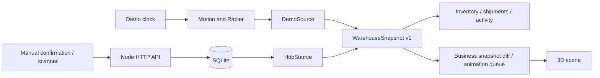

# Plantbox architecture

[中文](architecture.md) · [English](architecture.en.md)

## Two isolated operating modes

- `/#/en/demo`: the original 30-minute physical simulation. State lives in the browser and resets on reload.
- `/#/en/operations`: persisted backend data. User actions go through validated HTTP commands.

Both modes implement `WarehouseDataSource` and expose `WarehouseSnapshot` v1. Inventory, shipment and activity pages share these contracts, models and camera controls. The demo keeps its Rapier handling. Operations turn confirmed snapshot changes into a separate animation queue, reusing constrained truck paths and forklift handling paths. Rendering and animation never update persisted inventory.



## Modules

| Path                                                       | Responsibility                                                                                |
| ---------------------------------------------------------- | --------------------------------------------------------------------------------------------- |
| `src/config/`                                              | Site metadata, dock IDs/coordinates, sample catalog and demo assignments                      |
| `src/domain/warehouse.ts`                                  | Versioned snapshot, pallet, shipment, event and command contracts; independent of React/Three |
| `src/data/`                                                | Demo/HTTP adapters, subscriptions, connection lifecycle and React provider                    |
| `src/state/uiStore.ts`                                     | Navigation, selection, camera, quality and UI notifications                                   |
| `src/state/simulationStore.ts`                             | Demo clock, playback, adjustments and physical delivery records                               |
| `src/runtime/DemoRuntime.tsx`                              | Demo route lifecycle and reset coordination                                                   |
| `src/runtime/livePlayback.ts` / `LivePlaybackProvider.tsx` | Confirmed operation playback, route clearance, cargo poses and subscriptions                  |
| `src/features/`                                            | Inventory, shipments, activity, inspector, scene tools and operations UI                      |
| `src/components/`                                          | Shared buttons, statuses, dialogs and error boundaries                                        |
| `src/Scene.tsx`, `Models.tsx`                              | Scene composition and procedural assets                                                       |
| `src/*Motion.ts`, `handlingPhysics.ts`                     | Existing constrained motion and physical handling                                             |
| `server/app.ts`                                            | HTTP transport, authentication, request validation and static serving                         |
| `server/repository.ts`                                     | Schema, transactions, business transitions, idempotency and inventory projections             |

The geometry and calibrated demo paths still target WH-01's three docks. Centralized configuration is not an arbitrary warehouse editor. Adding docks requires coordinated model, path and collision-test changes. Existing lighting, initial camera zoom and physical cargo handling are preserved.

## Run

Use Node.js 24.14+. SQLite uses Node's built-in module, which currently prints an experimental API warning.

```sh
npm install
npm run seed       # Optional sample tasks; preserves existing data
npm run dev:full   # Vite :5173 and backend :3001
```

Open `http://localhost:5173/#/en/operations`. Confirm arrival, docking and handling start. Then enter IDs from each shipment's pallet manifest, or use a scanner in keyboard-input mode. All assigned pallets must be confirmed before handling can complete and the vehicle can depart.

Run separately with `npm run dev` and `npm run server`. The original demo works without a backend. If the backend becomes unavailable, operations retain the last snapshot, show an error and disable mutations. They never fall back to simulated data. The HTTP adapter polls a complete snapshot every two seconds and reconnects automatically.

The default database is `data/warehouse.sqlite`, ignored by Git. Starting the backend does not invent data; `npm run seed` explicitly initializes labeled examples. Demo restocking and resets cannot modify the database.

```sh
npm run build
npm run server  # Serves dist and /api at http://127.0.0.1:3001 by default
```

Static hosting supports the homepage and physical demo. Operations need the Node service or a same-origin `/api` reverse proxy. The development proxy targets `127.0.0.1:3001`; update `vite.config.ts` if the backend port changes.

## Business invariants

- A pallet ID identifies a cargo unit containing SKU, quantity, batch, shipment and location. One SKU per pallet is supported initially.
- Shipment lifecycle: `expected → arrived → docked → handling → completed → departed`.
- Pallet confirmation is allowed only during handling, for a matching manifest/SKU and valid source location.
- Outbound confirmation moves `storage → truck`, decreasing stored stock. Inbound confirmation moves `truck → storage`, increasing it.
- Every manifest pallet must be confirmed before completion. Outbound departure marks cargo `departed` without deducting stock again. Received inbound cargo stays in storage after vehicle departure.
- Inventory is derived from persisted pallet positions and quantities. Reservations come from outbound manifest pallets still in storage.
- Each command, pallet update, shipment transition, event and revision update commits in one transaction.
- Identical retries with the same command ID do not apply twice. Reusing an ID for different content is rejected. Scanning a confirmed pallet with a new command ID is also rejected.
- Frames, browser clocks and physical contacts cannot change operational inventory. Mutations return complete authoritative snapshots; older in-flight polling responses cannot replace newer revisions.
- The database retains events; the API currently exposes the latest 100. Pagination, operator-level audit identities and reversals are not implemented yet.

## Operations playback

- The first snapshot initializes current positions without replaying history. Later snapshots are compared against the last accepted revision and pallet confirmations. Duplicate or stale revisions never enqueue twice; missed polling intervals can reconstruct the full workflow.
- Confirmations queue entry, reverse docking, door opening, individual pallet handling, door closing and departure. One action runs at a time. Swept vehicle paths must be clear; a blocked shipment yields to another available maneuver while retaining order within each shipment.
- Forklifts approach the requested position empty, insert, lift, reverse clear, carry low, place, withdraw and return. Pallet IDs and render objects remain stable. Outbound cargo travels with the truck; inbound cargo remains on the floor. Business pallets use a single-layer layout.
- This is kinematic playback of confirmed work, with cargo poses driven by forks and support surfaces. Operations do not load Rapier or represent live tracking. The original demo retains rigid bodies, contacts and physical delivery.
- Inventory and the business inspector update immediately after backend confirmation. Animation may lag; controls show pending actions, pause/resume and 1× / 2× / 4× speed. The desktop workspace pairs a large yard view with a phone-shaped field terminal. Operators select a vehicle, confirm arrival/docking/handling/departure, or fill a pallet ID from the manifest before explicitly confirming it. Inventory, full shipments and activity retain dedicated pages.
- Other operations tabs pause playback while preserving camera and progress; new confirmations still queue. Hidden browser tabs also pause. Reloading or leaving the operations route discards playback history and initializes from current business state.
- Small screens default to an unframed terminal with Actions / Scene switching. 3D loads only on first entering Scene. Playback pauses in the terminal while confirmations continue queuing, then resumes in Scene. Feedback distinguishes queued, playing and synchronized states per shipment. The camera smoothly reframes at operation boundaries.

## HTTP v1

- `GET /api/health`: health.
- `GET /api/v1/snapshot`: inventory, shipments, pallets and recent events.
- `POST /api/v1/commands`: `arrive / dock / start / confirm_pallet / complete / depart`.

```json
{
  "id": "a-unique-request-id",
  "type": "confirm_pallet",
  "shipmentId": "SHP-78442",
  "palletId": "KLY-1-001"
}
```

Quantities and SKU come from the server manifest. Confirmation requests cannot override inventory. If a network failure leaves the outcome uncertain, retry with the original command ID.

## Deployment and remaining work

See `.env.example` for the database path, address, port, trusted origins and API token. The service binds to loopback by default. External binding requires a `PLANTBOX_API_TOKEN` of at least 24 characters. Requests use `Authorization: Bearer …`; the UI retains the token only in memory, never bundles it into client code. Public operation additionally needs HTTPS, user login, roles, operator audit, backups and rate limiting.

This is a runnable local business foundation. Sample tasks come from the seed command. Production manifest creation/import, mixed-pallet split/merge, stock adjustments, cancellation, real tracking and camera integration remain future work. Scene geometry does not automatically adapt to arbitrary backend locations. Add manifest management and operator identity before integrating plate recognition and scanners into the same validated transaction boundary.

PostgreSQL can replace SQLite later while preserving the HTTP/snapshot protocol; the SQL and transaction adapter will require migration. Measure main-thread and scene load before moving demo physics into a Worker.

Run `npm test` and `npm run build`. Coverage includes the existing 30-minute physical regression, inbound/outbound stock, retries, duplicate scans, invalid transitions/manifests, persistence across restart, HTTP authentication and data-source lifecycle.
