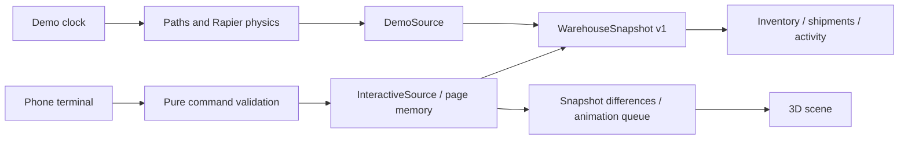

# Plantbox architecture

[中文](architecture.md) · [English](architecture.en.md)

## Runtime boundaries

The homepage and both demo routes run entirely in the browser and can be hosted statically:

- `/#/en/demo`: the original 30-minute physical simulation, driven by its clock and Rapier handling.
- `/#/en/operations`: interactive operations, with phone terminal actions driving yard animation.

They share `WarehouseSnapshot` / `WarehouseDataSource`, inventory, shipments, activity, models and cameras while keeping independent state. Snapshot modes are `demo` and `interactive` respectively. Operations uses a page-scoped memory source with no API requests, polling, credentials or database dependency.



## Modules

| Path                                                           | Responsibility                                                                                |
| -------------------------------------------------------------- | --------------------------------------------------------------------------------------------- |
| `src/config/`                                                  | Site metadata, dock positions, SKU catalog and sample vehicles                                |
| `src/domain/warehouse.ts`                                      | Versioned snapshot, pallet, shipment, command and event types                                 |
| `src/domain/commands.ts`                                       | Transitions, manifest validation and inventory projection; no React, Three or Node dependency |
| `src/data/demoSource.ts`                                       | Original physical demo adapter                                                                |
| `src/data/interactiveSource.ts`                                | Page-local interactive state, command deduplication and subscriptions                         |
| `src/data/WarehouseProvider.tsx`                               | One shared data source for the page                                                           |
| `src/state/uiStore.ts`                                         | Tabs, camera, selection, quality and interface state                                          |
| `src/state/simulationStore.ts` / `src/runtime/DemoRuntime.tsx` | Original simulation clock, physical deliveries and reset                                      |
| `src/runtime/livePlayback.ts` / `LivePlaybackProvider.tsx`     | Queued operations, road clearance, cargo poses and subscriptions                              |
| `src/features/operations/`                                     | Workspace, phone terminal, pallet confirmations and playback controls                         |
| `src/features/`                                                | Shared inventory, shipments, activity, details and scene tools                                |
| `src/Scene.tsx` / `Models.tsx`                                 | Physical simulation or operation animation selected by mode                                   |
| `src/*Motion.ts` / `handlingPhysics.ts`                        | Constrained vehicle paths and original rigid-body handling                                    |

WH-01 remains a fixed site with three calibrated docks. Adding docks requires coordinating models, paths and collision constraints.

## Running and deployment

```sh
npm install
npm run dev
```

Open `http://localhost:5173/#/en/operations` or `/#/zh/operations` to operate three sample vehicles. Confirm arrival, docking and handling start, then fill and confirm pallet IDs from the manifest. All pallets must be confirmed before handling completion and departure.

```sh
npm run build
npm run preview
```

Deploy `dist` to Vercel or another static host to use every website route. No Node service or `/api` proxy is required. Languages and pages use hash routing; assets assume deployment at the domain root.

## Data and command rules

- Each pallet has a stable ID, SKU, quantity, batch, shipment, location and confirmation flag. Initial cargo exists before handling begins.
- Shipment states: `expected → arrived → docked → handling → completed → departed`.
- Pallet confirmations are allowed only during `handling`, for matching shipments/SKUs at the expected source location.
- Inbound confirmations move pallets from `truck` to `storage`; outbound confirmations do the reverse. Stock is derived from stored pallet quantities; reservations come from outstanding outbound manifests.
- Completion requires a complete, fully confirmed manifest. Outbound departure marks aboard pallets `departed` without deducting stock again. Received inbound cargo remains in storage.
- Each command carries a unique ID. Identical retries do not double-count. Conflicting reuse, duplicate scans, wrong manifests and invalid steps are rejected.
- A successful command publishes one immutable snapshot containing shipment, pallet, inventory and activity updates. Failed operations leave the previous state intact.
- Data stays in the current operations page's memory. Internal tabs and language changes preserve it. Reloading, leaving the operations route or resetting restores initial data. Browsers and devices do not share state.

## Animation continuity

- The first snapshot initializes poses. Later revisions enqueue entry, reverse docking, door opening, individual handling, door closing and departure. Duplicate or stale revisions never enqueue twice.
- One action plays at a time. Swept truck paths enforce road clearance while retaining each shipment's operation order.
- Forklifts approach the selected position empty, insert, lift, reverse clear, carry low, place, withdraw and return. Pallet IDs and render objects remain stable. Outbound cargo moves with trucks; inbound cargo stays on the floor.
- The workspace uses operation-driven kinematic animation without Rapier or live tracking. The original full demo retains contacts, constraints and rigid-body cargo handling.
- Inventory and activity update immediately on confirmation; animation may follow from the queue. Controls show pending actions, pause/resume and 1× / 2× / 4× speeds.
- Desktop pairs the yard on the left with a phone terminal on the right. Small screens default to Actions; 3D loads only on entering Scene. Hidden scenes and browser tabs pause playback while preserving queued work.
- Terminal feedback distinguishes queued, playing and synchronized states for the current vehicle. Cameras reframe smoothly at action boundaries. Reset recreates the source and playback instance, clearing pending actions and scene objects.

## Earlier optional service code

`server/` and `src/data/httpSource.ts` retain the earlier Node.js + SQLite service implementation. The website does not use them and they do not need deployment. The persistence adapter shares the same pure command and inventory rules while retaining transactions and command deduplication.

## Validation

Run `npm test` and `npm run build`. Tests cover the original 30-minute physical simulation, truck/forklift paths, pallet continuity, all three interactive workflows without network access, stock accounting, invalid steps/manifests, retries and independent reset.
