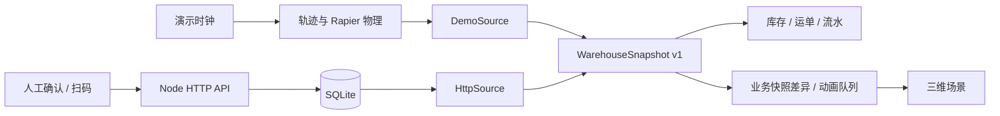

# Plantbox 架构

[中文](architecture.md) · [English](architecture.en.md)

## 运行边界

Plantbox 有两个互相隔离的数据入口：

- `/#/zh/demo`：原有 30 分钟物理演示，浏览器生成数据，刷新恢复初始状态。
- `/#/zh/operations`：业务后台入口，读取持久化数据；操作通过 HTTP 提交给后台确认。

两者共享 `WarehouseSnapshot` / `WarehouseDataSource`、库存页、运单页、流水页、场景模型与镜头。物理演示保留 Rapier 搬运；业务场景以已确认的快照变化驱动独立动画队列，复用卡车滚动约束轨迹与叉车取放路径。动画不修改后台状态或库存。



## 模块职责

| 路径                                                       | 职责                                                           |
| ---------------------------------------------------------- | -------------------------------------------------------------- |
| `src/config/site.ts`                                       | 站点名称、位置、标牌、月台 ID 与坐标                           |
| `src/config/catalog.ts`、`demo.ts`                         | 示例 SKU 目录、演示车辆与任务                                  |
| `src/domain/warehouse.ts`                                  | 版本化业务快照、托盘、运单、命令与事件类型；不依赖 React/Three |
| `src/data/`                                                | 演示与 HTTP 适配器、订阅生命周期、统一 React Provider          |
| `src/state/uiStore.ts`                                     | 页面、镜头、选择对象、画质、界面通知                           |
| `src/state/simulationStore.ts`                             | 仅演示使用的时间、速度、调整量、物理交付记录                   |
| `src/runtime/DemoRuntime.tsx`                              | 演示路由的时钟启停与重置协调                                   |
| `src/runtime/livePlayback.ts` / `LivePlaybackProvider.tsx` | 已确认业务的动画排队、道路让行、货物姿态与订阅生命周期         |
| `src/features/`                                            | 库存、运单、流水、详情、场景工具和作业管理                     |
| `src/components/`                                          | 公用按钮、状态、弹窗、错误边界                                 |
| `src/Scene.tsx`、`Models.tsx`                              | 场景与模型；根据模式选择物理演示或业务动画                     |
| `src/*Motion.ts`、`handlingPhysics.ts`                     | 保留原有受约束轨迹和物理搬运实现                               |
| `server/app.ts`                                            | HTTP 协议、鉴权、请求校验、静态文件服务                        |
| `server/repository.ts`                                     | 数据库结构、事务、状态转换、幂等与库存投影                     |

目前仍是 WH-01 的固定场地几何与三个月台演示路径。配置集中化不等于任意场地编辑器；增加月台需要同步校准模型、轨迹及碰撞测试。此次保留既有光影、镜头默认放大和货物搬运效果。

## 启动

使用 Node.js 24.14+。SQLite 使用 Node 的内置模块（当前运行时仍会打印实验性 API 提示）。

```sh
npm install
npm run seed       # 可选：初始化示例业务任务；不会覆盖已有数据
npm run dev:full   # Vite :5173 + 后台 :3001
```

打开 `http://localhost:5173/#/zh/operations`。先确认入场、靠台、开始装卸，再使用卡片中的托盘清单输入编号（或使用键盘输入模式的扫码枪）。所有托盘确认后，才允许完成作业与出场。

单独启动：`npm run dev` / `npm run server`。仅启动 Vite 仍可使用原有演示；后台不可用时，作业管理显示连接错误，保留上次数据并禁用业务操作，不切换成模拟数据。HTTP 适配器每 2 秒读取完整快照，断线自动重试，避免漏掉增量事件。

数据库默认在 `data/warehouse.sqlite`，已从 Git 排除。后台启动默认不写入示例数据；只有 `seed` 初始化样例。示例库在界面明确标注。演示的“模拟补货”和重置不会修改这个数据库。

```sh
npm run build
npm run server  # 同时提供 dist 静态文件及 /api；默认 http://127.0.0.1:3001
```

纯静态部署只支持官网和物理演示。业务入口需要 Node 服务或同源 `/api` 反向代理。开发代理默认指向 `127.0.0.1:3001`；改变后端端口时也需调整 `vite.config.ts`。

## 数据和业务规则

- 一个托盘 ID 对应本次货物单元，包含 SKU、数量、批次、运单和位置；目前每托盘一种 SKU。
- 运单状态：`expected → arrived → docked → handling → completed → departed`。
- 仅 `handling` 阶段允许确认托盘；托盘必须匹配运单与 SKU，当前位置必须符合入库/出库方向。
- 确认出库托盘：`storage → truck`，扣减在库数量。确认入库托盘：`truck → storage`，增加在库数量。
- 完成作业前必须确认清单内全部托盘。出库离场将托盘标记为 `departed`，不再次扣库存。入库车辆离场后，已收托盘仍在库内。
- 库存由数据库内托盘位置与数量汇总；预留量来自尚未装车的出库任务托盘。
- 每条命令、托盘位置、运单状态、流水和版本号在同一个事务中处理。
- 命令 ID 唯一。同 ID 同请求可安全重试，不重复结算；同 ID 不同请求拒绝。换新 ID 重复扫描已经确认的托盘也会拒绝。
- 页面时钟、帧率、物理落位均不能修改业务模式库存。每次成功操作返回完整权威快照；旧轮询响应不能覆盖更新的快照。
- 基础流水保留在数据库，接口当前返回最近 100 条。尚未实现分页、操作员身份审计和业务撤销。

## 业务动画

- 初次读取快照时直接呈现当前状态，不重播历史。后续按上一次接收的版本比较状态与托盘确认变化；重复或过期快照不重复播放，遗漏中间轮询也能补齐完整流程。
- 连续确认会排队播放：驶入 → 倒车靠台 → 开门 → 逐托搬运 → 关门 → 驶离。同一时刻执行一个动作；车辆扫掠路径被占用时，让可通行的其他运单先靠台或离场，保留单笔运单内部顺序。
- 叉车先空载前往目标货位，再插叉、举升、退离、低位运输、落货、退叉和返回。托盘 ID 与渲染对象不变；装车后随车运动，卸车后留在地面。业务托盘采用单层布局。
- 这是已确认作业的运动学回放，货物姿态由货叉和支承面计算；业务模式不启动 Rapier，也不表示现场实时定位。原有演示继续使用刚体、接触与物理交付。
- 库存及右侧业务详情立即显示后台确认结果，画面可滞后；顶部显示剩余动作并支持暂停、1× / 2× / 4×。桌面工作台左侧为 3D 园区，右侧为手机形态的现场操作终端，可选车、确认入场/靠台/装卸/出场，并从清单填入托盘编号后手动确认。库存、完整运单和流水保留独立页面。
- 切到库存、运单、流水页时暂停画面，保留镜头和播放进度；新确认继续加入队列。浏览器标签隐藏时也暂停。刷新或离开作业管理路由后重新按最新业务快照初始化。
- 小屏默认显示无设备边框的操作界面，通过“操作 / 场景”切换；首次进入场景才加载 3D。手机视图中的动画暂停并继续接收队列，返回场景恢复。每笔运单独立显示等待/播放/同步反馈；镜头在动作边界平滑聚焦到作业月台。

## HTTP v1

- `GET /api/health`：健康检查。
- `GET /api/v1/snapshot`：站点、库存、运单、托盘及最近事件。
- `POST /api/v1/commands`：提交 `arrive / dock / start / confirm_pallet / complete / depart`。

```json
{
  "id": "a-unique-request-id",
  "type": "confirm_pallet",
  "shipmentId": "SHP-78442",
  "palletId": "KLY-1-001"
}
```

数量和 SKU 由后台清单读取，客户端不能通过确认接口指定数量或覆盖库存。请求失败若不确定是否已提交，应使用原命令 ID 重试。

## 部署与后续扩展

`.env.example` 记录数据库路径、监听地址、端口、可信来源与 API 凭据。默认仅监听回环地址；监听外部网卡要求至少 24 字符的 `PLANTBOX_API_TOKEN`。凭据通过 `Authorization: Bearer …` 发送，界面仅保留在内存，不打包进前端。公网运行还需 HTTPS 反向代理、用户登录、角色权限、操作员审计、备份策略和服务限流。

目前提供的是本地可运行的业务基础闭环，示例任务通过 seed 建立。尚未实现生产清单导入/创建、混托拆并、盘点调整、任务取消、实时设备定位或摄像头接入。固定几何不会自动适应任意后台库位。后续优先增加清单管理和操作员身份，再接门口识车与扫码设备；摄像头事件经过身份校验和业务校验后进入同一套命令事务。

需要更大规模时，可将持久化迁移到 PostgreSQL，并保持 HTTP 与快照协议；当前 SQL/事务实现仍需适配迁移，并非替换连接字符串即可。先测量主线程与场景负载，再决定是否把演示物理移到 Worker。

验证命令：`npm test`、`npm run build`。测试涵盖原有 30 分钟物理回归，以及后台装卸、重复请求、重复扫码、非法状态、错误清单、重启持久化、鉴权和数据源生命周期。
