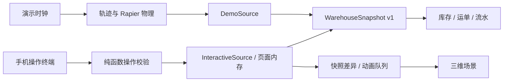

# Plantbox 架构

[中文](architecture.md) · [English](architecture.en.md)

## 运行边界

首页内嵌工作台和两个独立演示入口均为纯前端，构建产物可以直接静态托管：

- `/`、`/#/zh`：首屏可操作的工作台，后接项目介绍；与作业管理共享组件，默认展示手机操作。

- `/#/zh/demo`：原有 30 分钟物理演示，模拟时钟与 Rapier 搬运驱动数据。
- `/#/zh/operations`：交互作业演示，右侧手机终端操作驱动左侧园区动画。

两者共享 `WarehouseSnapshot` / `WarehouseDataSource`、库存页、运单页、流水页、模型和镜头，演示状态相互隔离。前者的快照模式为 `demo`，后者为 `interactive`。作业管理使用浏览器内存数据源，没有 API 请求、轮询、凭据或数据库依赖。首页以 `embedded` 布局复用作业管理：共用顶部网站导航，内嵌工作台不产生第二个主内容区域；语言切换保留当前工作台状态。



## 模块职责

| 路径                                                           | 职责                                                       |
| -------------------------------------------------------------- | ---------------------------------------------------------- |
| `src/config/`                                                  | 站点信息、月台坐标、SKU 与示例车辆                         |
| `src/domain/warehouse.ts`                                      | 版本化快照、托盘、运单、命令和事件类型                     |
| `src/domain/commands.ts`                                       | 状态转换、清单校验与库存投影；无 React、Three 或 Node 依赖 |
| `src/data/demoSource.ts`                                       | 原有物理演示的数据适配器                                   |
| `src/data/interactiveSource.ts`                                | 页面内存中的交互数据、命令去重和订阅                       |
| `src/data/WarehouseProvider.tsx`                               | 页面共享同一数据源                                         |
| `src/state/uiStore.ts`                                         | 页面、镜头、对象选择、画质和界面状态                       |
| `src/state/simulationStore.ts` / `src/runtime/DemoRuntime.tsx` | 原有演示的时钟、物理交付和重置                             |
| `src/runtime/livePlayback.ts` / `LivePlaybackProvider.tsx`     | 操作动画排队、道路让行、货物姿态和订阅                     |
| `src/features/operations/`                                     | 工作台、手机终端、逐托确认和动画控制                       |
| `src/features/`                                                | 共享库存、运单、流水、详情和场景工具                       |
| `src/Scene.tsx` / `Models.tsx`                                 | 按模式显示物理演示或操作动画                               |
| `src/*Motion.ts` / `handlingPhysics.ts`                        | 受约束车辆轨迹与原有刚体搬运                               |

目前仍是 WH-01 固定场地与三个月台。增加月台需要同步校准模型、轨迹和碰撞约束。

## 运行与部署

```sh
npm install
npm run dev
```

打开 `http://localhost:5173/#/zh/operations` 或 `/#/en/operations`，即可操作三辆示例车。先确认入场、靠台和开始装卸，再从托盘清单填入编号并确认。全部托盘确认后，才允许完成作业和出场。

```sh
npm run build
npm run preview
```

将 `dist` 部署到 Vercel 或其他静态托管即可使用全部网站入口，无需启动 Node 服务或配置 `/api` 代理。语言与页面使用哈希路由，资源部署在域名根目录。

## 数据和操作规则

- 每托盘具有稳定编号、SKU、数量、批次、运单、位置和确认状态，初始货物提前存在。
- 运单状态：`expected → arrived → docked → handling → completed → departed`。
- 仅 `handling` 阶段允许确认托盘；托盘必须匹配运单与 SKU，且位于预期来源。
- 入库确认把托盘从 `truck` 移到 `storage`；出库确认反向移动。库存按场内托盘数量求和，预留量按未交付的出库清单计算。
- 完成作业要求清单完整且全部确认；出库车离场把车内货物标为 `departed`，不会再次扣减库存。入库货物留在场内。
- 命令带唯一 ID；同 ID、同内容的重试不重复结算；不同内容复用 ID、重复扫码、错误清单或非法步骤都会被拒绝。
- 校验完成后一次发布新快照，同时更新运单、托盘、库存与流水。旧快照不被修改，失败操作不改变数据。
- 所有数据仅保存在当前作业管理页面内存。切换内部页或语言保留进度；刷新、离开当前工作台路由或重置演示会恢复初始状态。不同浏览器与设备不共享数据。

## 动画衔接

- 首份快照初始化当前姿态；后续版本差异排队为驶入、倒车靠台、开门、逐托搬运、关门和驶离。重复或旧版本不重复排队。
- 一次播放一个动作；按整车扫掠范围检查道路让行，保持每辆车的动作顺序。
- 叉车按选中的货位空叉接近、插叉、举升、退离、低位运输、落货、退出并返回。托盘 ID 与渲染对象保持稳定；出库货物随车运动，入库货物留在地面。
- 工作台是操作驱动的运动学动画，不加载 Rapier，也未接实时定位。原有完整演示继续使用接触、约束和刚体搬运。
- 库存与流水随确认立即更新，动画可以排队滞后。顶部显示待播放数量，并支持暂停和 1× / 2× / 4×。
- 桌面左侧园区、右侧手机终端；小屏默认进入操作页，切到场景时才加载 3D。隐藏场景或浏览器标签页时暂停播放，队列保留。
- 首页滚动到项目介绍时，IntersectionObserver 暂停三维绘制与动画；返回工作台后继续播放，数据和队列保留。
- 手机终端区分当前车辆的等待、播放和同步状态，镜头在动作边界自然切换。重置会重新创建数据源与动画实例，清除所有残留动作和场景对象。

## 可选历史服务代码

`server/` 和 `src/data/httpSource.ts` 保留早期 Node.js + SQLite 服务实现，当前网站不会使用它们。服务器适配器复用同一套纯函数校验与库存规则，并保留事务和命令去重；这些文件无需部署。

## 验证

运行 `npm test` 和 `npm run build`。测试覆盖原有 30 分钟物理演示、卡车及叉车轨迹、逐托搬运与对象连续性，以及无网络下三辆车完整交互、库存计算、非法步骤、错误清单、命令去重和独立重置。
